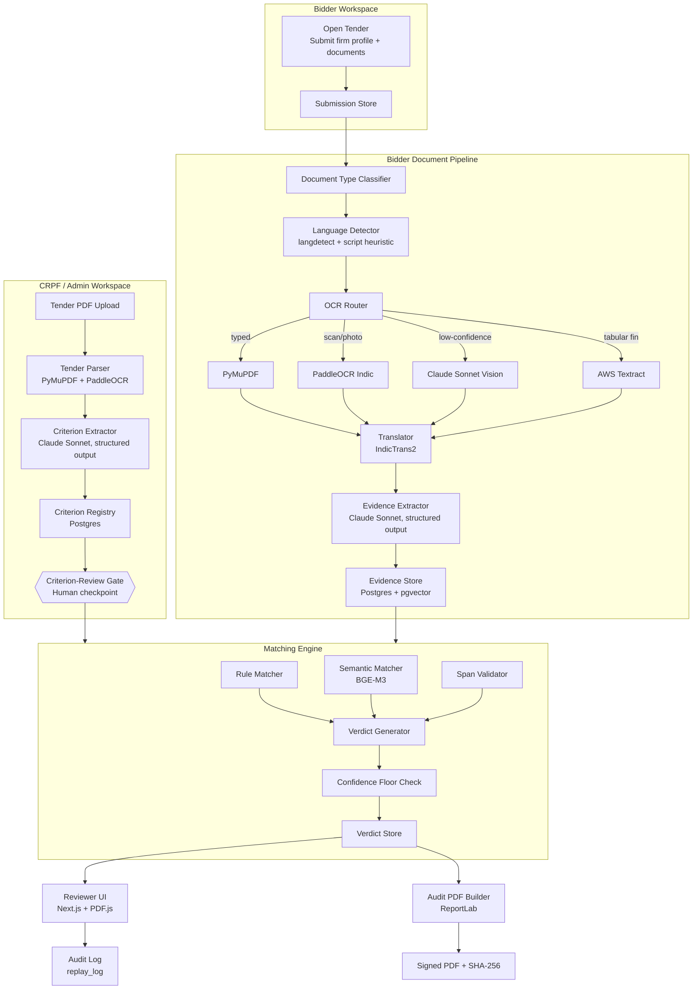

# ARCHITECTURE.md — TenderSaarthi

> Technical architecture: components, data flow, API surface, data model, key design decisions. Read after `IDEA.md`.

## High-level architecture



## Workspace model

TenderSaarthi has two product workspaces.

### CRPF / Admin workspace
Procurement officers use this workspace to create tenders, upload tender PDFs, approve extracted criteria, monitor bidder submissions, run evaluations, inspect verdicts, approve or override results, and generate audit reports. Admin routes own the evaluation and audit surfaces.

Target admin routes:
- `/tenders` or `/admin/tenders` — tender dashboard.
- `/tenders/new` or `/admin/tenders/new` — tender PDF upload.
- `/tenders/{id}/review-criteria` — criterion-review gate.
- `/tenders/{id}/submissions` — received bidder submissions.
- `/tenders/{id}/verdicts` — verdict matrix.
- `/tenders/{id}/audit` — audit report.

### Bidder workspace
Bidder users use this workspace to view open tenders, open public tender details, submit firm details and documents for one tender, and track their own submission status. Bidder routes must not expose other bidders, reviewer actions, internal criteria edits, model outputs, verdict matrices, or audit reports.

Target bidder routes:
- `/bidder/tenders` — open tenders.
- `/bidder/tenders/{id}` — public tender details.
- `/bidder/tenders/{id}/submit` — firm profile + document upload.
- `/bidder/submissions/{id}` — status for the bidder's own submission.

The current mock phase may keep `/tenders/{id}/bidders` as an admin-assisted upload shortcut for demo speed. Treat it as a prototype shortcut, not the target product boundary.

## Component breakdown

### 1. Tender Parser (`backend/app/services/tender/parser.py`)

**Inputs:** raw PDF bytes.
**Outputs:** ordered list of `(page_number, text, layout_hints)` tuples.

- For typed PDFs (text layer present), use **PyMuPDF** for clean text + per-character bounding boxes.
- For scanned tender PDFs (rare but possible), fall back to **PaddleOCR**. Tenders are typically typed; we keep the fallback only for the long tail.
- Pre-processing: deskew (PaddleOCR's built-in), drop blank pages, merge soft-hyphenated words.

### 2. Criterion Extractor (`services/tender/criterion_extractor.py`)

**Inputs:** parsed tender text.
**Outputs:** list of `Criterion` records (typed).

- Calls **Claude Sonnet 4.6** with Pydantic structured output.
- Prompt strategy: chunk the tender into ~3000-token windows with overlap; extract per chunk; deduplicate at the end by clause similarity (BGE-M3 cosine > 0.92).
- Each criterion classified into: `TECHNICAL` / `FINANCIAL` / `COMPLIANCE` / `DOCUMENT` / `CERTIFICATION`.
- Each criterion tagged `is_mandatory` based on tender language ("shall", "must", "essential" → mandatory; "may", "preferred", "desirable" → optional).
- Each criterion has a `threshold` (typed) where applicable: `{"type": "min_amount_inr", "value": 50000000}` or `{"type": "min_count", "value": 3}` or `{"type": "must_exist", "value": true}`.
- Verbatim source text preserved as `description` for audit.

### 3. Criterion-Review Gate (frontend page + state machine)

The tender record has a status field: `UPLOADED` → `EXTRACTING` → `AWAITING_REVIEW` → `CRITERIA_APPROVED`.

No bidder evaluation can run until status is `CRITERIA_APPROVED`. Enforced in `services/matching/engine.py` at the entry point.

The reviewer can edit any criterion (description, mandatory flag, threshold), delete extracted criteria that are not actually eligibility rules, or add criteria the LLM missed. Every edit is logged.

### 4. Bidder Submission + Document Pipeline

Bidder submission starts in the bidder workspace. A submission belongs to exactly one tender and one bidder. Once received, the document pipeline parses the bundle and produces evidence records for matching.

#### Document Type Classifier
A small heuristic — file extension + magic bytes + presence of a text layer in PDFs. Outputs one of: `TYPED_PDF` / `SCANNED_PDF` / `IMAGE` / `DOCX`.

#### Language Detector
Page-level. langdetect for the first pass; a Devanagari/Kannada/Tamil script heuristic for short snippets where langdetect is unreliable.

#### OCR Router
The decision tree:
```
If document_type == TYPED_PDF:
    use PyMuPDF
Elif document_type == DOCX:
    use python-docx
Elif language in PADDLEOCR_INDIC_LANGUAGES:
    use PaddleOCR
    if PaddleOCR confidence < 0.85 OR document_type == IMAGE:
        re-run with Claude Sonnet vision
Elif language has Tesseract weights:
    use Tesseract
Else:
    use Claude Sonnet vision (fallback path)
```

#### Translator
**IndicTrans2** wraps the AI4Bharat checkpoint. Inputs: source text + source language code. Outputs: English translation + translation confidence.

Original-language text is **always** preserved alongside the translation in the `evidence` table — this is what gets shown when the reviewer toggles language in the UI, and what the audit PDF cites in its original form.

#### Evidence Extractor
Per criterion category, a different Claude Sonnet prompt template extracts the relevant value from the bidder's parsed documents.

For example, for a `min_amount_inr` financial criterion, the prompt asks the model to find a "total annual turnover" figure in the bidder's audited financial statements and return:
```json
{
  "found": true,
  "value": 75000000,
  "currency": "INR",
  "fiscal_year": "2023-24",
  "source_document_id": "doc-abc",
  "page": 3,
  "bbox": [120.5, 450.2, 380.7, 478.9],
  "raw_span": "Total Revenue from Operations: ₹7.5 crore",
  "extraction_confidence": 0.92
}
```

If the model is uncertain, it returns `{"found": false, "reason": "..."}`. The verdict generator interprets that as `NEEDS_MANUAL_REVIEW`.

### 5. Matching Engine (`services/matching/engine.py`)

**Inputs:** approved criteria + extracted evidence per bidder.
**Outputs:** verdicts.

The engine runs three matchers in order:

#### Rule Matcher
For criteria with typed thresholds, do the comparison directly. If turnover criterion threshold is ₹5 cr and bidder evidence value is ₹7.5 cr → `ELIGIBLE` (unless confidence floor fails).

#### Semantic Matcher
For criteria where evidence might be phrased differently from the criterion clause, embed both with **BGE-M3** and check cosine similarity. Threshold per category:
- `COMPLIANCE`: 0.78
- `CERTIFICATION`: 0.85 (these tend to be exact-name matches)
- `TECHNICAL`: 0.75 (more variation in language)

#### Span Validator
Take the LLM-extracted value, take the LLM-claimed source span, and verify the value is actually present in the span. This catches hallucination: if the LLM claims it found "₹7.5 crore" on page 3 but the page 3 text says "₹0.75 crore", the validator catches it and flags the verdict for review.

### 6. Verdict Generator (`services/verdict/generator.py`)

Takes matcher output and applies the **confidence floor** rule:

```
if min(ocr_confidence, extraction_confidence, translation_confidence) < floor[category]:
    verdict = NEEDS_MANUAL_REVIEW
    reason = "below_confidence_floor"
elif rule_match == True and span_validator == True:
    verdict = ELIGIBLE
elif rule_match == False (threshold not met) and span_validator == True:
    verdict = NOT_ELIGIBLE
elif rule_match == True and span_validator == False:
    verdict = NEEDS_MANUAL_REVIEW
    reason = "span_validation_failed"
else:
    verdict = NEEDS_MANUAL_REVIEW
```

Every verdict carries: `verdict`, `reason`, `evidence_ref`, `model_version`, `prompt_hash`, `replay_id`, `created_at`.

### 7. Reviewer UI (`frontend/`)

Pages:
- `/tenders` or `/admin/tenders` — admin tender dashboard.
- `/tenders/[id]` — admin overview + status badge.
- `/tenders/[id]/review-criteria` — the criterion-review gate.
- `/tenders/[id]/submissions` — admin view of bidder submissions for that tender.
- `/tenders/[id]/verdicts` — bidder × criterion matrix.
- `/tenders/[id]/audit` — final report download.
- `/bidder/tenders` — bidder-facing list of open tenders.
- `/bidder/tenders/[id]` — bidder-facing tender details.
- `/bidder/tenders/[id]/submit` — bidder-facing firm profile and document upload.
- `/bidder/submissions/[id]` — bidder-facing submission status.

The verdict matrix uses a side-panel pattern: click a cell, side panel opens with the criterion text, evidence value, confidence, and an embedded PDF.js viewer scrolled to the cited page with a bounding box overlay. Reviewer can toggle language, approve, or override.

### 8. Audit PDF Builder (`services/audit/report_builder.py`)

ReportLab. Templated, deterministic. Takes a `tender_id` and produces a PDF where the contents (excluding the SHA-256 line at the bottom) are hashed and the hash printed on the last page. Re-running with the same input produces an identical report (excluding the timestamp line).

## Data model

```sql
-- Core entities
CREATE TABLE tenders (
  id UUID PRIMARY KEY,
  title TEXT NOT NULL,
  procuring_department TEXT,
  uploaded_at TIMESTAMPTZ NOT NULL,
  status TEXT NOT NULL CHECK (status IN ('UPLOADED','EXTRACTING','AWAITING_REVIEW','CRITERIA_APPROVED','EVALUATING','EVALUATED','SIGNED')),
  source_pdf_uri TEXT NOT NULL,
  source_pdf_hash TEXT NOT NULL
);

CREATE TABLE criteria (
  id UUID PRIMARY KEY,
  tender_id UUID NOT NULL REFERENCES tenders(id),
  category TEXT NOT NULL CHECK (category IN ('TECHNICAL','FINANCIAL','COMPLIANCE','DOCUMENT','CERTIFICATION')),
  description TEXT NOT NULL,           -- verbatim clause
  is_mandatory BOOLEAN NOT NULL,
  threshold JSONB,                      -- typed per category
  source_page INT,
  source_bbox JSONB,
  approved_at TIMESTAMPTZ,
  approved_by UUID REFERENCES users(id),
  embedding VECTOR(1024)                -- BGE-M3
);

CREATE TABLE bidders (
  id UUID PRIMARY KEY,
  legal_name TEXT NOT NULL,
  contact_email TEXT,
  created_at TIMESTAMPTZ NOT NULL
);

CREATE TABLE submissions (
  id UUID PRIMARY KEY,
  tender_id UUID NOT NULL REFERENCES tenders(id),
  bidder_id UUID NOT NULL REFERENCES bidders(id),
  status TEXT NOT NULL CHECK (status IN ('DRAFT','SUBMITTED','PROCESSING','EVIDENCE_READY','NEEDS_CORRECTION','WITHDRAWN')),
  submitted_at TIMESTAMPTZ,
  updated_at TIMESTAMPTZ NOT NULL
);

CREATE TABLE bidder_documents (
  id UUID PRIMARY KEY,
  submission_id UUID NOT NULL REFERENCES submissions(id),
  filename TEXT NOT NULL,
  content_hash TEXT NOT NULL,
  document_type TEXT NOT NULL,
  detected_languages TEXT[],
  storage_uri TEXT NOT NULL
);

CREATE TABLE evidence (
  id UUID PRIMARY KEY,
  submission_id UUID NOT NULL REFERENCES submissions(id),
  bidder_id UUID NOT NULL REFERENCES bidders(id),
  criterion_id UUID NOT NULL REFERENCES criteria(id),
  document_id UUID NOT NULL REFERENCES bidder_documents(id),
  page INT NOT NULL,
  bbox JSONB,
  extracted_value JSONB NOT NULL,       -- typed payload
  raw_span TEXT,
  raw_span_language TEXT,
  translated_span TEXT,
  ocr_confidence FLOAT,
  extraction_confidence FLOAT,
  translation_confidence FLOAT,
  embedding VECTOR(1024)
);

CREATE TABLE verdicts (
  id UUID PRIMARY KEY,
  bidder_id UUID NOT NULL REFERENCES bidders(id),
  criterion_id UUID NOT NULL REFERENCES criteria(id),
  evidence_id UUID REFERENCES evidence(id),
  verdict TEXT NOT NULL CHECK (verdict IN ('ELIGIBLE','NOT_ELIGIBLE','NEEDS_MANUAL_REVIEW')),
  reason TEXT NOT NULL,
  model_version TEXT NOT NULL,
  prompt_hash TEXT NOT NULL,
  replay_id UUID NOT NULL,
  created_at TIMESTAMPTZ NOT NULL,
  reviewer_action TEXT,                -- 'APPROVED' | 'OVERRIDDEN' | NULL
  reviewer_id UUID REFERENCES users(id),
  reviewer_reason TEXT,
  reviewer_action_at TIMESTAMPTZ
);

CREATE TABLE replay_log (
  id UUID PRIMARY KEY,
  replay_id UUID NOT NULL,             -- groups all calls in one evaluation run
  call_type TEXT NOT NULL,             -- 'OCR' | 'LLM_EXTRACTION' | 'LLM_VERDICT' | etc.
  model_name TEXT NOT NULL,
  model_version TEXT,
  prompt_hash TEXT,
  input_hash TEXT NOT NULL,
  output JSONB NOT NULL,
  confidence FLOAT,
  latency_ms INT,
  created_at TIMESTAMPTZ NOT NULL
);

CREATE TABLE reviewer_actions (
  id UUID PRIMARY KEY,
  user_id UUID NOT NULL REFERENCES users(id),
  action TEXT NOT NULL,                -- 'EDIT_CRITERION' | 'APPROVE_CRITERIA' | 'OVERRIDE_VERDICT' | etc.
  entity_type TEXT NOT NULL,
  entity_id UUID NOT NULL,
  before_state JSONB,
  after_state JSONB,
  reason TEXT,
  created_at TIMESTAMPTZ NOT NULL
);

CREATE TABLE audit_reports (
  id UUID PRIMARY KEY,
  tender_id UUID NOT NULL REFERENCES tenders(id),
  generated_at TIMESTAMPTZ NOT NULL,
  generated_by UUID REFERENCES users(id),
  pdf_uri TEXT NOT NULL,
  content_hash TEXT NOT NULL,          -- SHA-256 of report content
  replay_id UUID NOT NULL
);
```

Indexes on: every FK, `tenders.status`, `verdicts.verdict`, `evidence.criterion_id`, `replay_log.replay_id`, vector indexes on `criteria.embedding` and `evidence.embedding` (HNSW via pgvector).

## API surface (selected)

```
POST   /api/v1/tenders                      # upload tender PDF
GET    /api/v1/tenders                      # list tenders
GET    /api/v1/tenders/{id}                 # tender overview
GET    /api/v1/tenders/{id}/criteria        # extracted criteria
PATCH  /api/v1/tenders/{id}/criteria/{cid}  # edit one criterion
POST   /api/v1/tenders/{id}/criteria/approve # lock the criterion set

GET    /api/v1/public/tenders               # bidder-facing open tenders
GET    /api/v1/public/tenders/{id}          # bidder-facing tender details
POST   /api/v1/public/tenders/{id}/submissions # create bidder submission
POST   /api/v1/submissions/{id}/documents   # multipart upload
GET    /api/v1/submissions/{id}             # bidder's own submission status
GET    /api/v1/tenders/{id}/submissions     # admin view of submissions
GET    /api/v1/submissions/{id}/evidence    # admin/reviewer evidence view

POST   /api/v1/tenders/{id}/evaluate        # run evaluation (Celery)
GET    /api/v1/tenders/{id}/verdicts        # verdict matrix
POST   /api/v1/verdicts/{id}/override       # reviewer override
POST   /api/v1/verdicts/{id}/approve        # reviewer approve

POST   /api/v1/tenders/{id}/replay          # re-run, return diff
GET    /api/v1/tenders/{id}/report.pdf      # download signed PDF
GET    /api/v1/tenders/{id}/replay-log      # full audit trail (JSON)
```

All responses: `{ data: ..., meta: { request_id, timestamp } }`. Errors: RFC 7807.

## Key design decisions (and their alternatives we rejected)

1. **Postgres + pgvector instead of a dedicated vector DB.** One database to manage; transactional consistency between criteria, evidence, and embeddings. Loses some scale headroom — fine for prototype, fine for a single-department production deployment.
2. **Cloud LLM (Claude Sonnet) primary, on-prem (Llama 3.3) as a slide.** Building both for Round 2 is a budget mistake. The on-prem story is a deck slide and a config flag — we demo the cloud path.
3. **Criterion-review gate is a hard state-machine constraint, not a UX suggestion.** The matching engine refuses to run without `CRITERIA_APPROVED`. This makes the differentiator real, not cosmetic.
4. **Confidence floors are per-modality, not global.** A 0.85 floor for OCR is reasonable; a 0.85 floor for typed PDFs would silently flag everything. Tuning per modality is a small thing that matters.
5. **Span validation is the last matcher.** If the LLM claims a value but it isn't in the span, we don't trust the LLM — we flag for review. This single check catches the most common LLM failure mode in document-heavy pipelines.
6. **ReportLab for PDF, not a templating service.** Deterministic, dependency-light, hashable output. A web-based PDF service would add latency and a non-determinism risk for the audit hash.

## Out of scope (Round 2)

- Multi-tenant authentication / RBAC (single admin user is fine for the demo).
- Real GeM integration (we work on uploaded PDFs).
- L1 financial evaluation (we only do the eligibility envelope).
- Tender authoring tools.
- Mobile app.
- Real-time collaboration on the criterion-review gate.
